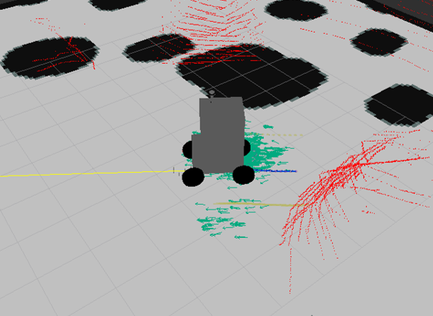

# Package **soma_base**

Navigation with **move_base**



## Navigation simulation

- In first terminal :

```
roslaunch soma_description gazebo.launch
```

- In second terminal :

```
roslaunch soma_base move_base.launch
```
