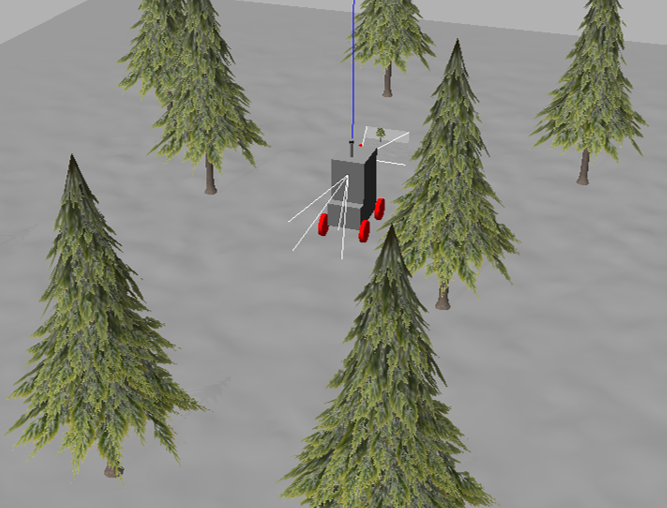

<<<<<<< HEAD
# soma_description

## Detail
SOMAの3次元モデルに関する記述ファイル(URDF,xmlなどなど)を管理し，
robot_state_publisherのlaunchを持っているパッケージ．  
- launchしたらロボット座標とセンサ座標間のtfが全てtf_staticに投げられるようにすること．
- SOMAの3Dモデル管理
- SOMA上に取り付けた各センサの配置関係も記述
- センサ(2021.7)
  - VLP-16 (Velodyne)
  - Realsense D435 (Intel)
  - MTi-30 (xsense)


## Static tf structure of SOMA (2021.7)  
[SOMA URDF FILE](./urdf/soma.urdf.xacro)  
base_footprint  
└ base_link : 後輪軸中心  
　├ imu : MTi-30原点  
　├ camera_f : 前方D435原点  
　├ camera_r : 後方D435原点  
　├ lidar : velodyne原点

## Launch  
[launch FILE](./launch/description.launch)    

```
roslaunch soma_description description.launch
```
=======
# Package **soma_description**

Robot model, visualization in Rviz, simulation in Gazebo, driving with rqt_robot_steering GUI



## Robot simulation

- Only Rivz

  ```
  roslaunch soma_description rviz.launch
  ```

- Only Gazebo

  - In first terminal :

    ```
    roslaunch soma_description gazebo.launch
    ```

  - In second terminal :

    ```
    roslaunch soma_description controllers.launch
    ```

- Both

  - In first terminal :

    ```
    roslaunch soma_description simulation.launch
    ```

  - In second terminal :

    ```
    roslaunch soma_description controllers.launch
    ```
>>>>>>> soma_simulation
