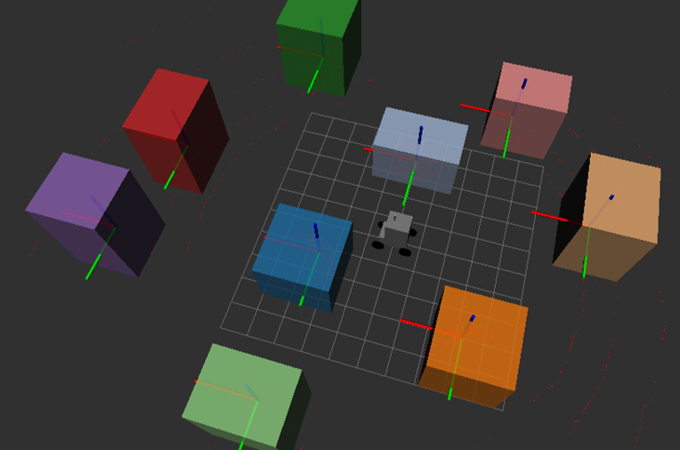

# Package **soma_online_slam**

Online Simultaneous Localization And Mapping (SLAM)



## Tree poses extraction

- In first terminal :

  ```
  roslaunch soma_description gazebo.launch
  ```

- **If you want to drive the robot**, in second terminal :

  ```
  roslaunch soma_description controllers.launch
  ```

- In third terminal :
  ```
  roslaunch soma_online_slam tree_poses.launch
  ```
